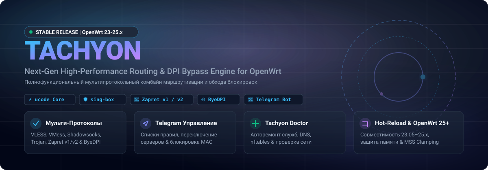

<div align="center">



[](https://github.com/Dushnilin/tachyon/stargazers)
[](https://github.com/Dushnilin/tachyon/releases)
[](https://openwrt.org/)
[](LICENSE)

[**🇷🇺 Русский**](README.md) | [**🇬🇧 English**](README.en.md)

</div>

---

## ⚡ About Tachyon

**Tachyon** is an advanced fork of **Forkop** (formerly **Podkop Plus**). The project has evolved into an independent, high-performance network routing engine and DPI bypass framework designed specifically for **OpenWrt**.

Building upon the solid engineering foundations of the original [Podkop by @itdoginfo](https://github.com/itdoginfo/podkop), Tachyon introduces enterprise-grade resilience, multi-protocol routing, and dynamic system self-healing.

The core backend of Tachyon is written in **ucode** — OpenWrt's native, lightweight scripting language — delivering blazingly fast execution with minimal RAM footprint on embedded hardware.

---

## 🔥 Key Features

### 🛡️ Multi-Protocol Proxying & Local DPI Bypass
* **sing-box Integration**: Native support for modern proxy protocols including **VLESS**, **VMess**, **Shadowsocks**, **Trojan**, and **WireGuard**.
* **Local DPI Bypass (zapret2 / ByeDPI)**: Built-in integration with `zapret2` (`nfqws2`) and `ByeDPI` for on-device Deep Packet Inspection bypass without relying on remote servers.
* **Granular Selective Routing**: Custom rules based on domain names, IP CIDR blocks, and ports. Route only target traffic through proxy or DPI desync engines.
* **Automated Subscription Updates**: Background fetching and parsing of remote proxy subscription links.

### 🤖 Interactive Telegram Control Bot
A feature-rich control center right inside your messenger:
* **Live Rule Management**: View active routing lists and instantly add new domains or IP subnets on the fly.
* **Instant Toggle**: Enable or disable routing sections with a single button.
* **Server Selection & Latency**: Switch active proxy nodes with live RTT ping measurements.
* **Device Access Control**: View active DHCP clients and block/unblock internet access by MAC address.
* **Network Diagnostics**: Trigger connection tests directly from Telegram.

### 🩺 System Self-Healing — Tachyon Doctor
An intelligent diagnostic and repair engine available via CLI (`tachyon doctor`) or WebUI:
* Scans all core services (`sing-box`, `zapret2`, `byedpi`, `dnsmasq`, `watchdog`).
* Validates `nftables` chains and local DNS resolution health.
* **Auto-Repair**: Automatically rebuilds broken firewall rules and restarts crashed services without requiring a full router reboot.

### ⚡ Reliability, Hot-reload & Watchdog
* **Seamless Hot-Reload**: Rule updates and server switches apply softly without dropping active TCP connections (Discord calls, VoIP, and downloads remain uninterrupted).
* **OOM Watchdog & Memory Tuning**: Continuous RAM health monitoring. Dynamically adjusts process limits (`GOMEMLIMIT`) under memory pressure and sends Telegram alerts.
* **MSS Clamping (MTU Fix)**: Automated resolution of MTU fragmentation and frozen TCP handshakes over tunnel interfaces.

### 🖥️ Modern Web Interface (LuCI)
* Native integration into OpenWrt's LuCI dashboard.
* Real-time latency tracking, subscription manager, rule editor, and service controls.

---

## 💻 Installation

Run the following single command in your router's SSH terminal:

```bash
sh <(wget -O - https://raw.githubusercontent.com/Dushnilin/tachyon/main/install.sh)
```

> [!NOTE]
> **Automatic Migration:** Existing configurations from **Forkop**, **Podkop Plus**, or original **Podkop** are fully compatible. The installer will automatically migrate your settings to `/etc/config/tachyon`.

---

## 🤝 Upstream Projects & Credits

Tachyon stands on the shoulders of incredible open-source projects:

* 🐕 **[Podkop (itdoginfo)](https://github.com/itdoginfo/podkop)** — The original project that inspired our architecture.
* 📦 **[sing-box](https://github.com/SagerNet/sing-box)** — Universal proxy engine.
* 🚀 **[zapret2](https://github.com/bol-van/zapret2)** & **[zapret2-mcp](https://github.com/rcd27/zapret2-mcp)** — DPI desync framework and knowledge base.
* 🌐 **[ByeDPI](https://github.com/hrbrmstr/byedpi)** — Local SOCKS desync proxy.

---

## 💖 Support & Donations

If Tachyon powers your daily networking and helps keep your connection fast and secure, consider supporting ongoing development! ☕ 🧀 🌭

💳 **Credit Cards / SBP / Tinkoff Pay:**  
👉 [**Support the project via CloudTips**](https://pay.cloudtips.ru/p/48c57581)

---

<div align="center">

Made with ❤️ for OpenWrt Community

</div>
